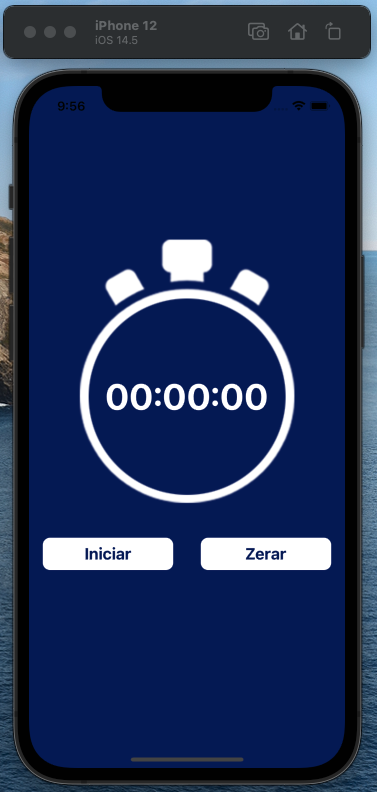
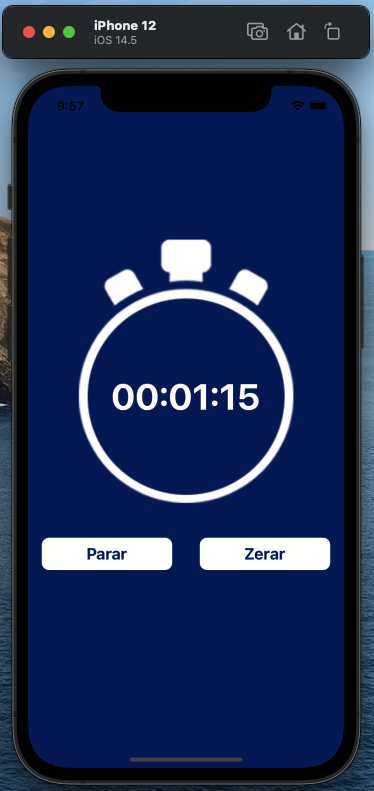
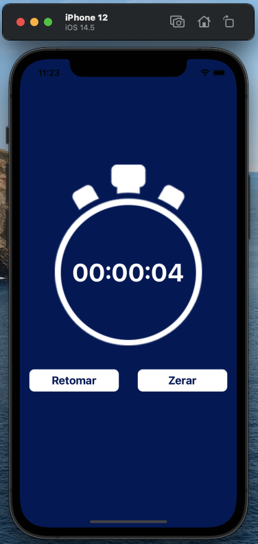
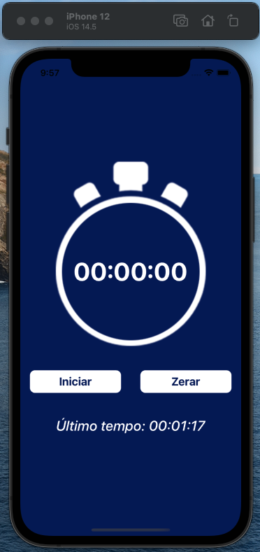

# App Cronômetro

Olá, este é um app de cronômetro feito com **React Native**.

As regras utilizadas para o funcionamento foram feitos com JavaScript puro, sem nenhuma biblioteca para facilitar o desenvolvimento. Foi feito deste jeito justamente para treinar algumas funcionalidades da linguagem.

## Como funciona?

Como qualquer outro cronômetro, ele inicia a contagem, pode parar o cronômetro, retomar e zerar a contagem.

### Tela inicial do App

### Iniciando a contagem do cronômetro

* Clicando em iniciar ele começa a contagem

### Parando e retomando a contagem

* Clique em **Parar** e a contagem é interrompida
* Clique em **Retomar** para continuar a contagem

### Zerar o cronômetro

* Clicando a qualquer momento no botão **Zerar**, automaticamente o cronômetro zera a contagem e aparece o histórico da **Último Tempo** cadastrado abaixo

